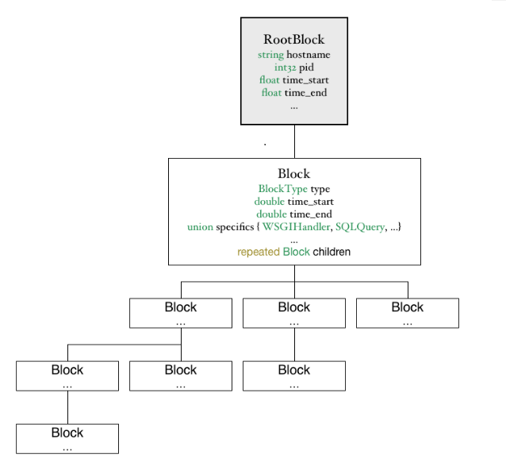
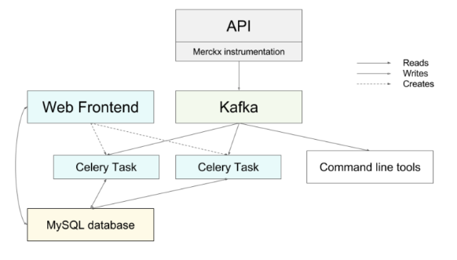
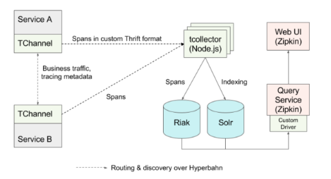
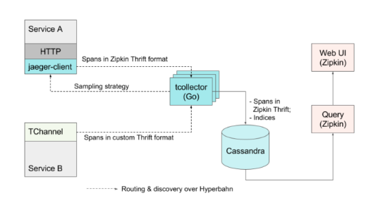
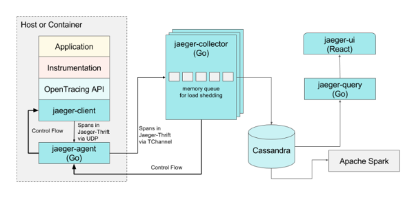
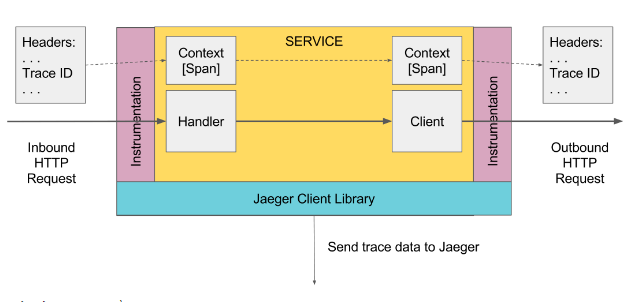
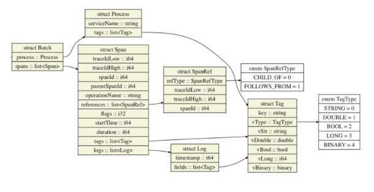
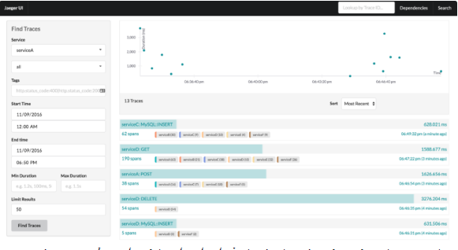

# Jaeger
## 1. Giới thiệu về Uber Jaeger
* **Bối cảnh**: Việc truy xuất phân tán trở thành một thành phần phải có các công cụ mà một tổ chức sử dụng để giám sát các kiến trúc phức tạp dựa trên kiến trúc microservice
* **Từ Monolith đến Microservices**: Vì hoạt động kinh doanh của Uber đã phát triển theo cấp số nhân nên sự phức tạp của kiến trúc phần mềm.  Điều này một phần là do sự gia tăng số lượng các tính năng kinh doanh – người dùng mà hệ thống phải đối mặt, cũng như các chức năng nội bộ như phát hiện gian lận, khai thác dữ liệu và xử lý bản đồ. Một lý do khác là chuyển các ứng dụng sang kiến trúc microservices phân phối. Di chuyển vào một hệ sinh thái microservices mang lại nhưng thách thức riêng. Đó là sự mất khả năng hiển thị trong hệ thống, các tương tác phức tạp giữa các dịch vụ. Các công cụ giám sát truyền thống như số liệu và phân loại phân tán  vẫn có vị trí cửa chúng, tuy nhiên chúng thường không cung cấp khả năng hiển thi qua các dịch vụ. Đây là nơi phát tán các dấu vết 
* **Tại Uber Engineering**:hệ thống phân phối mã nguồn mở Jaeger đã nhận được sự chấp nhận nội bô vào năm 2016, được tích hợp vào hàng tram microservices và ghi lại hàng nghìn dấu vết mỗi giây.
* 
## 2. Tracing Uber’s Beginning
* Hệ thống truy tìm được sử dụng rộng rãi đầu tiền ở Uber là Merckx. Nó nhanh chóng trả lời các câu hỏi về sự phức tạp về phụ trợ Python nguyên khối của Uber. Dữ liệu profiling được tổ chức thành các khối, với mỗi khối đại diện cho một hoạt động nhất định.

Merckx mô hình biểu đồ cuộc gọi
* Thiết bị Merckx đã tự động áp dụng một số thư viện hạ tầng trong Python, bao gồm các máy khách và máy chủ HTTP, các truy vấn SQL , các cuộc gọ Redis và cả việc tuần tự hóa JSON. Thiết bị ghi lại một số chỉ số nhất định và siêu dữ liệu về mỗi hoạt động như URL cho cuộc gọi HTTP hoặc truy vấn SQL cho các cuộc gọi cơ sở dữ liệu. Đồng thời cũng nắm bắt thông tin như thời gian các giao dịch cơ sở dữ liệu còn mở và nhưng mảnh cơ sở dữ liệu và bản sao được truy cập.

Kiến trúc Merckx là một mô hình kéo từ dòng dữ liệu ở Kafka
* Một hạn chế thú vị khác của Merckx là nhiều tính năng như theo dõi giao dịch cơ sở dữ liệu thực sự chỉ hoạt động dưới [uWSGI]( https://uwsgi-docs.readthedocs.io/en/latest/) vì dữ liệu được lưu trữ trong kho lưu trữ cục bộ.  Một khi Uber bắt đầu áp dụng [Tornado]( http://www.tornadoweb.org/en/stable/) một khung ứng dụng không đồng bộ cho các dịch vụ Python, bộ nhơ thread-local không thể biểu diễn nhiều yêu cầu đồng thời chay cùng một chủ đề trên IOLoop của Tornado
* Vào đầu năm 2015, họ bắt đầu phát triển TChannel, một giao thức ghép kênh và ghép kênh cho RPC. Một trong những mục tiêu thiết kế của giao thức này là phải có phân loại Dapper theo kiểu xây dựng trong giao thức như lớp đầu tiên. Để hướng tới mục tiêu đó, đặc tả giao thức TChannel đã định nghĩa các trường tìm kiếm là một phần của định dạng nhị phân.
Ngoài ra họ còn phát hành nhiều thư viện mã nguồn mở. Các thư viện khuyến khích các nhà phát triển ứng dụng viết mã của họ với sự phân bố ngữ cảnh phân tán.
Thư viện TChannel gần gũi với hệ thống tìm kiếm phân phối Uber, cung cấp các khối xây dựng:
* Interprocess tuyên truyền của bối cảnh truy tim, in-band với các yêu cầu
* API thiết bị ghi lại khoảng thời gian
* Quá trình tuyên truyền của bối cảnh truy tìm
* Định dạng và cơ chế báo cáo truy xuất dữ liệu trong quá trình xử lý đề truy tìm nguồn phụ trợ
Họ đã xây dựng một hệ thống phụ trợ nguyên mẫu kết hợp một số thành phần tùy chỉnh với giao diện Zipkin để tạo thành một hệ thống truy tìm hoàn chỉnh.

Kiến trúc của phụ trợ nguyên mẫu cho các dấu vết được tạo ra bởi TChannel
## 3. Kiến trúc Jaeger
### Cũ

Kiến trúc Jaeger dựa vào định dạng lưu trữ Zip và giao diện Zipkin
* Từ bỏ nguyên mẫu dựa trên Riak/ Solr. Hộ đã thực hiện lại các bộ sưu tập trong Go để chấp nhận lưu lượng TChannel và lưu trữ nó trong Cassandra theo định dạng nhị phân tương thích với Zipkin mà không cần sửa đổi và cung cấp chức năng tìm kiếm dấu vết bị mất. 
* Truy xuất tất cả các dịch vụ hiện có mà không sử dụng TChannel cho RPC.  Họ đã xây dựng các thư viện phía khách hàng trong Go, Java, Python và Node.js để hỗ trợ các thiết bị của các dịch vụ tùy ý. 
### Hiện tại

Kiến trúc Jaeger hiện tại: các thành phần phụ trợ được thực hiện trong Go, các thư viện khác hàng  bằng OpenTracing, một front-end  và ống dữ liệu tổng hợp và xử lý trên Apache Spark.

## 4. Data Model của Jaeger

Mô hình dữ liệu hỗ trợ khai báo giá trị khóa và các tham chiếu về khoảng thời gian, Nó cũng tối ưu hóa khối lượng dữ liệu được gửi ra khỏi quá trình bằng các tránh trùng lặp thẻ quá trình mỗi khoảng
Giao diện web hoàn toàn mới được xây dựng với React:

## 5. Các thư viện của Jaeger
-	[Go]( https://github.com/uber/jaeger-client-go)
-	[Java](https://github.com/uber/jaeger-client-java)
-	[Node.js](https://github.com/uber/jaeger-client-node)
-	[Python](https://github.com/uber/jaeger-client-python)
## 6. Tài liệu tham khảo
[Uber documentation](https://eng.uber.com/distributed-tracing/)